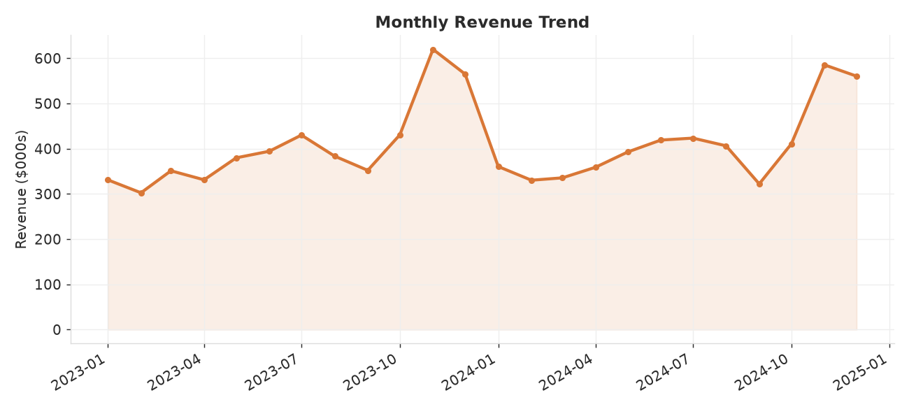
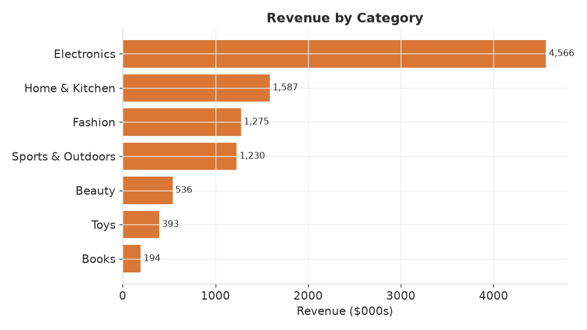
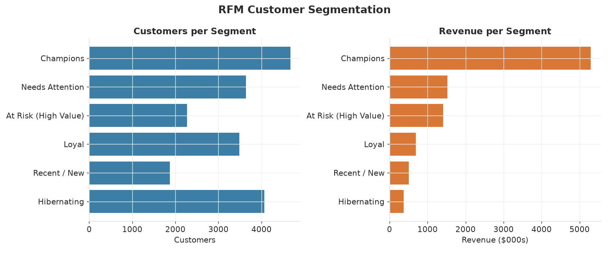

# Retail E-commerce Analytics + RFM Customer Segmentation

End-to-end exploratory analysis of a two-year online-retail order history, plus
an **RFM (Recency, Frequency, Monetary) segmentation** that groups customers by
value so marketing spend can be targeted.

> **Data note:** the dataset is generated by `generate_data.py` with a fixed seed.
> It models realistic patterns — Q4 holiday seasonality, a long tail of one-time
> buyers with a small "whale" segment, category-dependent pricing, and ~7%
> returns — so the whole project is reproducible offline.

## Stack
`Python` · `pandas` · `numpy` · `matplotlib`

## How to run
```bash
pip install -r requirements.txt
python generate_data.py   # writes data/online_retail.csv
python analysis.py        # writes charts + summary to outputs/
```

## Headline metrics
| Metric | Value |
| --- | --- |
| Gross revenue | ~$9.8M |
| Orders | 37,564 |
| Unique customers | 20,000 |
| Average order value | $279.59 |
| Repeat-customer rate | 36.1% |
| Return rate | 6.9% |

## What the analysis shows

### Revenue is highly seasonal
Monthly revenue climbs into a pronounced November–December peak in both years,
confirming the holiday season as the key revenue window for inventory and ad
planning.



### Electronics dominates the catalogue


### A small group of customers drives most revenue (RFM)
Each customer is scored 1–4 on Recency, Frequency, and Monetary value and mapped
to an actionable segment.



**Key insight:** *Champions* are ~23% of the customer base but generate **54% of
revenue**. Meanwhile *At Risk (High Value)* customers hold ~14% of revenue and
are the highest-priority win-back target. See [`outputs/summary.md`](outputs/summary.md)
for the full segment table.

## Files
- `generate_data.py` — reproducible synthetic dataset generator
- `analysis.py` — KPIs, trend/category charts, and RFM segmentation
- `outputs/` — generated charts, `summary.md`, and `metrics.json`
