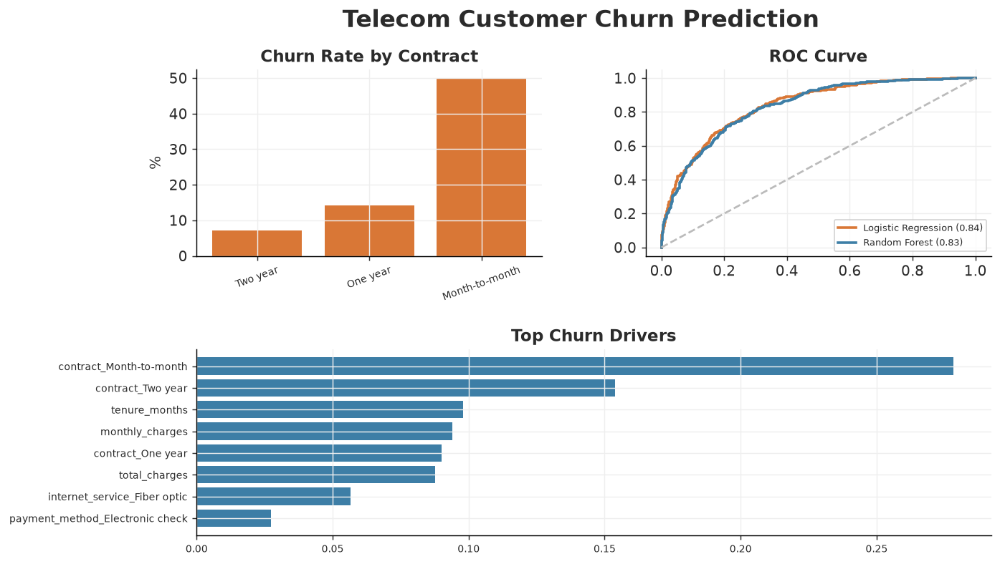
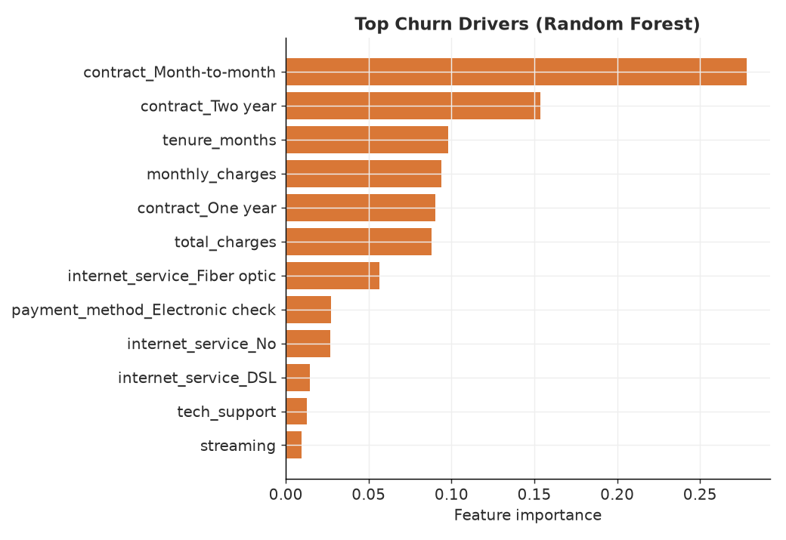

# Telecom Customer Churn Prediction

A supervised-learning project that predicts which telecom customers are likely
to **churn**, then explains *why* so the business can target retention offers.
Built as an end-to-end scikit-learn pipeline: EDA → preprocessing → model
training → evaluation → interpretation.

> **Data note:** `generate_data.py` produces the dataset with a fixed seed. Churn
> is a logistic function of contract type, tenure, charges, internet service,
> support add-ons, and payment method (plus noise), mirroring the classic Telco
> churn problem while remaining fully reproducible.

## Stack
`Python` · `scikit-learn` · `pandas` · `matplotlib`

## How to run
```bash
pip install -r ../requirements.txt
python generate_data.py   # writes data/telecom_churn.csv
python analysis.py        # trains models, writes charts + summary to outputs/
```

## Approach
- **EDA** on churn drivers (contract, tenure, monthly charges).
- **Preprocessing** with a `ColumnTransformer`: one-hot encoding for categoricals,
  standardisation for numerics, wrapped in a `Pipeline` (no leakage).
- **Models:** Logistic Regression and Random Forest, both with
  `class_weight="balanced"` to handle the 32% churn base rate.
- **Evaluation** on a stratified 25% hold-out: accuracy, precision, recall, F1,
  and ROC-AUC, plus a confusion matrix and ROC curve.

## Results (held-out test set)
| Model | Accuracy | Precision | Recall | F1 | ROC-AUC |
| --- | ---: | ---: | ---: | ---: | ---: |
| Logistic Regression | 0.745 | 0.60 | 0.78 | 0.68 | **0.838** |
| Random Forest | 0.740 | 0.60 | 0.78 | 0.68 | 0.833 |

Recall is prioritised — for churn, catching would-be leavers matters more than
the occasional false alarm. See [`outputs/summary.md`](outputs/summary.md).



### Churn drivers
The Random Forest confirms the intuitive risk profile: **month-to-month
contracts, short tenure, high monthly charges, fiber-optic service, and
electronic-check payment**.



## Business takeaway
Month-to-month fiber customers on electronic check in their first year are the
highest-risk group. Moving them onto annual contracts (with an incentive) and
auto-pay directly attacks the top predictors of churn.

## Files
- `generate_data.py` — reproducible dataset generator
- `analysis.py` — EDA, modelling pipeline, evaluation, interpretation
- `outputs/` — charts, `summary.md`, `metrics.json`
