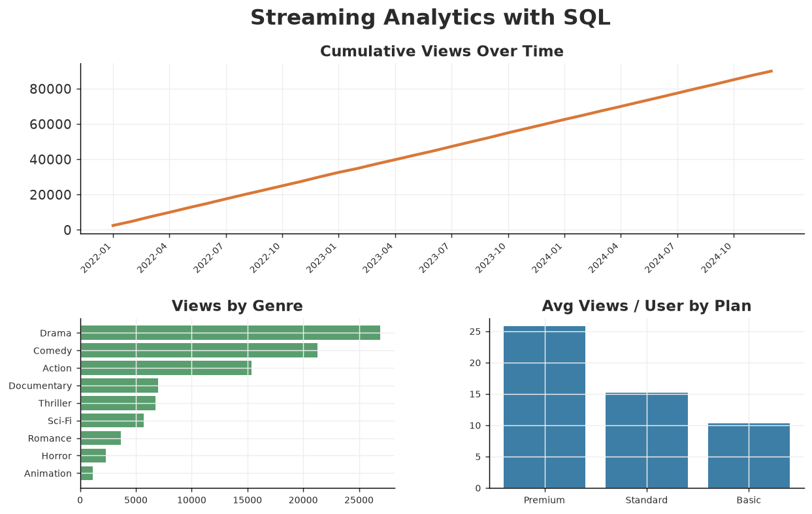

# Streaming Analytics with SQL

A SQL-first analytics project on a small **relational SQLite database** for a
streaming service. It demonstrates real analytical SQL — multi-table `JOIN`s,
CTEs, aggregations, and **window functions** (`RANK`, `LAG`, running `SUM`) —
then visualises the results with Python.

> **Data note:** `generate_data.py` builds `data/streaming.db` (seeded) with three
> related tables — `users`, `titles`, and `views` — modelling genre-driven
> popularity and plan-driven engagement so the queries return interesting results.

## Stack
`SQL` · `SQLite` · `Python` · `pandas` · `matplotlib`

## Schema
```
users(user_id, country, plan, monthly_price, signup_date)
titles(title_id, title, type, genre, release_year, runtime_min, country, date_added)
views(view_id, user_id → users, title_id → titles, watch_date, minutes_watched, completed, rating)
```

## How to run
```bash
pip install -r ../requirements.txt
python generate_data.py   # builds data/streaming.db
python run_queries.py     # runs queries.sql, writes charts + summary to outputs/
```

All queries live in [`queries.sql`](queries.sql). `run_queries.py` parses that
file (splitting on `-- name:` markers), executes each query, and renders charts.

## What the queries answer
- **`genre_performance`** — views, avg rating, completion rate, and hours per genre (JOIN + aggregation).
- **`top_titles_per_genre`** — the top 3 titles in each genre with `RANK() OVER (PARTITION BY genre …)`.
- **`monthly_growth`** — monthly views with a running total (`SUM() OVER`) and MoM growth (`LAG()`).
- **`engagement_by_plan`** — average views/user and total hours by subscription tier.
- **`revenue_by_country`** — monthly subscription revenue by market.
- **`power_users`** — the top 10 subscribers by minutes watched (`RANK() OVER (ORDER BY …)`).

## Key findings
- **Drama, Comedy, and Action** dominate viewing; the long tail (Horror,
  Animation) is niche.
- **Engagement scales with plan tier** — Premium subscribers watch ~2.5× as
  many titles per user as Basic, supporting up-sell economics.
- Views grow steadily month over month across the three-year window (~$68K MRR).



See [`outputs/summary.md`](outputs/summary.md) for the full result tables.

## Files
- `generate_data.py` — builds the seeded SQLite database
- `queries.sql` — the analytical SQL (JOINs, CTEs, window functions)
- `run_queries.py` — executes the queries and renders charts
- `outputs/` — charts and `summary.md`
