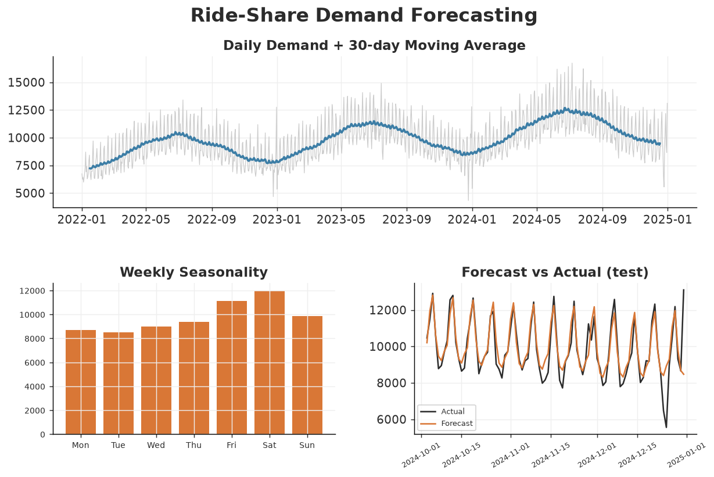

# Ride-Share Demand Forecasting (Time Series)

A time-series project that analyses **daily urban ride-share demand** and
forecasts the next quarter. It decomposes trend and seasonality, engineers
calendar features, and benchmarks regression forecasts against a seasonal-naive
baseline.

> **Data note:** `generate_data.py` builds a seeded 3-year daily series combining
> a growth trend, weekly seasonality (Fri/Sat peaks), yearly seasonality
> (summer high / winter low), holiday effects, and noise.

## Stack
`Python` · `scikit-learn` · `pandas` · `matplotlib`

## How to run
```bash
pip install -r requirements.txt
python generate_data.py   # writes data/rideshare_demand.csv
python analysis.py        # writes charts + summary to outputs/
```

## Approach
- **Decomposition:** 30-day moving average for trend; day-of-week averages for
  weekly seasonality.
- **Features:** day-of-week and month (one-hot), a global time index for trend,
  and sine/cosine of day-of-year for annual seasonality. These are all knowable
  in advance, so the models produce genuine forecasts (no leakage).
- **Models:** Linear Regression and Random Forest, benchmarked against a
  **seasonal-naive** baseline (demand from the same weekday one week earlier).
- **Validation:** forecast the final 90 days and score with MAE, RMSE, and MAPE.

## Results (final 90 days)
| Model | MAE | RMSE | MAPE |
| --- | ---: | ---: | ---: |
| Seasonal-naive (t-7) | 717 | 1,102 | 7.58% |
| **Linear Regression** | **491** | **816** | **5.37%** |
| Random Forest | 665 | 944 | 6.99% |

The calendar-feature **Linear Regression cuts MAPE to 5.4%**, ~29% better than
the seasonal-naive baseline, by explicitly modelling trend plus weekly and
yearly seasonality.



Remaining error concentrates on holidays (e.g. the Christmas dip), which pure
calendar features don't fully capture — a natural next step would be an explicit
holiday regressor. See [`outputs/summary.md`](outputs/summary.md).

## Files
- `generate_data.py` — reproducible daily-demand generator
- `analysis.py` — decomposition, feature engineering, models, evaluation
- `outputs/` — charts, `summary.md`, `metrics.json`
